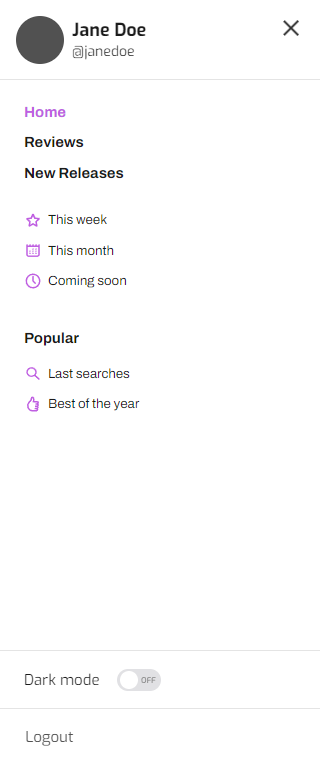
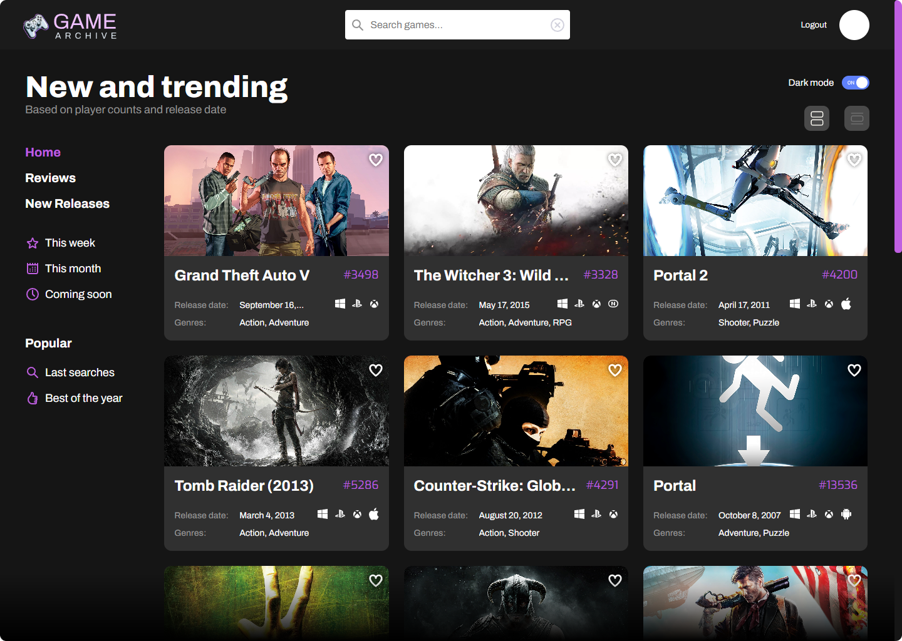

<div align="center">
<h1 align="center">

<br>AltimetrikGameFinderApp
</h1>
<h3>◦ Developed with the software and tools listed below.</h3>

<p align="center">


</p>
</div>

---

## 📒 Table of Contents

-   [📒 Table of Contents](#-table-of-contents)
-   [📍 Overview](#-overview)
-   [🔧 Features](#-features)
-   [🧩 Modules](#modules)
-   [🚀 Getting Started](#-getting-started)
-   [🗺 Roadmap](#-roadmap)
-   [👏 Acknowledgments](#-acknowledgments)

---

## 📍 Overview

Game Finder is a web application designed to provide users with an easy way to search for and view data about various games using the <a href="https://rawg.io/apidocs">RAWG API</a>. Whether you want to explore new games or find information about your favorite titles, Game Finder has got you covered.

---
### 🔧 Features

### 1. 📝 Register

- Register a new account to access the page (a default account was already created, so you don't have to; more information will be provided in the login section).
- Use **JSON Server Auth** to register your account into the database (please note that this is a mock database for front-end purposes, and its functionalities are limited and insecure).
- See the account creation process in the [Account creation Demo](https://scribehow.com/shared/Create_your_GameFinder_account__boIPYb8xTb2z2FDXV3Ykxg).


<br>

### 2. 🔑 Login

- Use **JSON Server Auth** to log into your new account.
- Use of _session token_ for authenticated created accounts.
  - Default account created has the email: **exampleemail@gmail.com** and the password **password123**.
  - You are also welcome to log in with your own registered account.


<br>

### 3. 🔎 Games Searching

- Search for any games you want on the page.
- Get a fast response with a list of games with the name that you search using the **RAWG API**.


<br>

### 4. ⏱️ Last Searches

- Use of **Local Storage** to store latest searches made.
- Get a list of latest searches and click on any of them to return to the search.


<br>

### 5. 📱 Mobile/Tablet Friendly Design

- You can use **Game Finder** from any of your devices!
- Example images about responsive design:

<div align="center">
  
  
  
</div>

<br>

### 6. 🌓 Dark/Light Mode Support

- Use **GameFinder** in the theme that you prefer!
- We set the theme to your computer's preferred schema, but you can change it anytime you want from inside the app.

<div align="center">
  
  
</div>
---

<br>

## 🧩Modules

<details closed><summary>Root</summary>

| File                                                                                                                    | Summary                     |
| ----------------------------------------------------------------------------------------------------------------------- | --------------------------- |
| [index.html](https://github.com/elios11/AltimetrikGameFinderApp/blob/main/index.html)                                   | Home Page                   |
| [login.html](https://github.com/elios11/AltimetrikGameFinderApp/blob/main/login.html)                                   | Login Page                  |
| [register.html](https://github.com/elios11/AltimetrikGameFinderApp/blob/main/register.html)                             | Register Page               |
| [script.js](https://github.com/elios11/AltimetrikGameFinderApp/blob/main/script.js)                                     | JavaScript Core             |
| [style.css](https://github.com/elios11/AltimetrikGameFinderApp/blob/main/style.css)                                     | Main Styles                 |
| [formattedDate.js](https://github.com/elios11/AltimetrikGameFinderApp/blob/main/scripts\formattedDate.js)               | Date Formatting             |
| [home.js](https://github.com/elios11/AltimetrikGameFinderApp/blob/main/scripts\home.js)                                 | Home Page Functionality     |
| [localStorageEnabled.js](https://github.com/elios11/AltimetrikGameFinderApp/blob/main/scripts\localStorageEnabled.js)   | Local Storage Check         |
| [login.js](https://github.com/elios11/AltimetrikGameFinderApp/blob/main/scripts\login.js)                               | Login Page Functionality    |
| [logout.js](https://github.com/elios11/AltimetrikGameFinderApp/blob/main/scripts\logout.js)                             | Logout Functionality        |
| [platformIcons.js](https://github.com/elios11/AltimetrikGameFinderApp/blob/main/scripts\platformIcons.js)               | Platform Icons Data         |
| [redirectUnloggedUser.js](https://github.com/elios11/AltimetrikGameFinderApp/blob/main/scripts\redirectUnloggedUser.js) | Unlogged User Redirection   |
| [register.js](https://github.com/elios11/AltimetrikGameFinderApp/blob/main/scripts\register.js)                         | Register Page Functionality |
| [showCardData.js](https://github.com/elios11/AltimetrikGameFinderApp/blob/main/scripts\showCardData.js)                 | Game Card Data Display      |
| [toggleTheme.js](https://github.com/elios11/AltimetrikGameFinderApp/blob/main/scripts\toggleTheme.js)                   | Dark/Light Mode Toggle      |
| [colors.css](https://github.com/elios11/AltimetrikGameFinderApp/blob/main/styles\colors.css)                            | Color Styles                |
| [hamburger-menu.css](https://github.com/elios11/AltimetrikGameFinderApp/blob/main/styles\hamburger-menu.css)            | Hamburger Menu Styles       |
| [home.css](https://github.com/elios11/AltimetrikGameFinderApp/blob/main/styles\home.css)                                | Home Page Styles            |
| [login.css](https://github.com/elios11/AltimetrikGameFinderApp/blob/main/styles\login.css)                              | Login Page Styles           |
| [modals-styling.css](https://github.com/elios11/AltimetrikGameFinderApp/blob/main/styles\modals-styling.css)            | Modals Styles               |
| [register.css](https://github.com/elios11/AltimetrikGameFinderApp/blob/main/styles\register.css)                        | Register Page Styles        |

</details>

---

## 🚀 Getting Started

### ✔️ Prerequisites

Before you begin, ensure that you have the following prerequisites installed:

- ℹ️ Make sure you have Node.js installed on your machine. You can download it from the official website: <a href="https://nodejs.org/"><em>Node.js</em></a>.
- ℹ️ NPM (Node Package Manager) comes bundled with Node.js, so you should have it installed as well.
- ℹ️ Install VSCode (Visual Studio Code) if you don't have it, it will work as a tool to open the app later.
- ℹ️ Install [Live Server extension in VSCode](https://marketplace.visualstudio.com/items?itemName=ritwickdey.LiveServer).


### 📦 Installation

1. Clone the AltimetrikGameFinderApp repository:

```sh
git clone https://github.com/elios11/AltimetrikGameFinderApp
```

2. Open the project folder in VSCode:

```sh
Open VSCode, press File in the left upper corner and select Open Folder, from there just select the recently cloned AltimetrikGameFinderApp folder.
```

3. In a terminal, install the dependencies:
   (<em>you can start a terminal in VSCode by pressing terminal and then new terminal on the upper bar</em>)<br>

```sh
npm install
```

4. Start running Json-server-auth:

```sh
npx json-server-auth db.json -m ./node_modules/json-server-auth
```

### 🎮 Using AltimetrikGameFinderApp

```sh
Click on Live Server on the bottom of VSCode to open the app in a browser, and you are in!
```

## 🗺 Roadmap

- [x] ℹ️  Task 1: Create project on GitHub
- [x] ℹ️  Task 2: Create Login Screen View
- [x] ℹ️  Task 3: Add Login functionality
- [x] ℹ️  Task 4: Connect with RAWG API
- [x] ℹ️  Task 5: Create the card list with one column
- [x] ℹ️  Task 6: Create the card list with three columns
- [x] ℹ️  Task 7: Create the side bar
- [x] ℹ️  Task 8: Create the header with search bar
- [x] ℹ️  Task 9: Implement search game functionality
- [x] ℹ️  Task 10: Add last searches functionality
- [x] ℹ️  Task 11: Add Game Modal functionality

---

## 👏 Acknowledgments

- ℹ️  The design and idea of this project was made by [Altimetrik](https://altimetrik.com/) for their **_Become a Front End Developer with Altimetrik_ (BEFEDA)** program.
