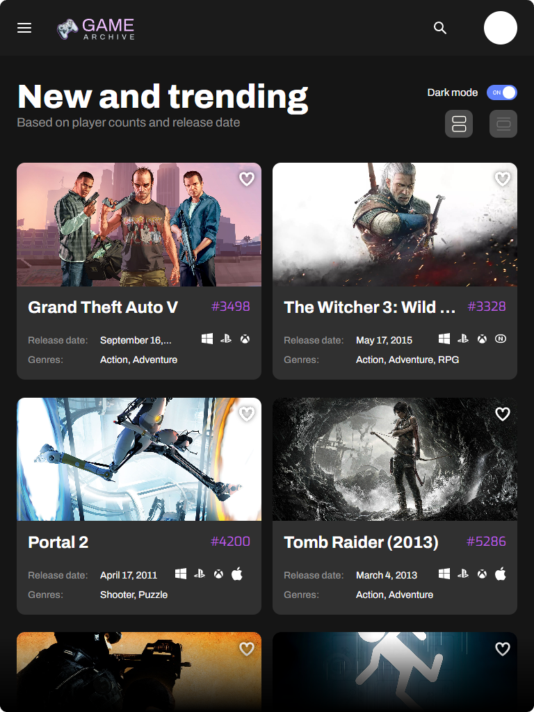

<div align="center">
<h1 align="center">

<br>AltimetrikGameFinderApp
</h1>
<h3>◦ Developed with the software and tools listed below.</h3>

<p align="center">


</p>
</div>

---

## 📒 Table of Contents

-   [📒 Table of Contents](#-table-of-contents)
-   [📍 Overview](#-overview)
-   [⚙️ Features](#-features)
-   [📂 Project Structure](#project-structure)
-   [🧩 Modules](#modules)
-   [🚀 Getting Started](#-getting-started)
-   [🗺 Roadmap](#-roadmap)
-   [🤝 Contributing](#-contributing)
-   [📄 License](#-license)
-   [👏 Acknowledgments](#-acknowledgments)

---

## 📍 Overview

Game Finder is a web application designed to provide users with an easy way to search for and view data about various games using the <a href="https://rawg.io/apidocs">RAWG API</a>. Whether you want to explore new games or find information about your favorite titles, Game Finder has got you covered.

---

## ⚙️ Features

<style>
    img {
        border-radius:10px;
    }
    .group-of-images {
        display: flex;
        align-items: center;
        flex-wrap: wrap;
        gap: 20px;
    }
</style>
<h1 align="center">1.<br>👇<br><br>📝 Register</h1>
<table>
    <tr>
        <td>
            <h3>◦ Register a new account to access to the page (a default account was already created so you don't have to, more information will be provided in the login section).</h3>
            <ul>
                <li>Use <b>JSON Server Auth</b> to register you account into the database (please note that this is a mock database for front-end purposes, and its functionalities are limited and insecure).</li>
                <li>See the account creation process in the <a href="https://shields.io/">Account creation Demo</a>.</li>
            </ul>
        </td>
    </tr>
    <tr>
        <td>
            <br>
            
        </td>
    </tr>
</table>
<br>
<h1 align="center">2.<br>👇<br><br>🔑 Login</h1>
<table>
    <tr>
        <td>
            <h3>◦ Use <b>JSON Server Auth</b> to log into your new account.</h3>
            <ul>
                <li>Use of <em>session token</em> for authenticated created accounts.
                <ul>
                    <li>Default account created has the email: <b>exampleemail@gmail.com</b> and the password <b>password123</b>.</li>
                    </li>
                    <li>You are also welcome to log in with your own registered account.
                    </li>
                </ul>
            </ul>
        </td>
    </tr>
    <tr>
        <td>
            <br>
            
        </td>
    </tr>
</table>
<br>
<h1 align="center">3.<br>👇<br><br>🔎 Games searching</h1>
<table>
    <tr>
        <td>
            <h3>◦ Search for any games you want in the page</h3>
            <ul>
                <li>Get a fast response with a list of games with the name that you searches using the <b>RAWG API</b></li>
            </
        </td>
    </tr>
    <tr>
        <td>
            <br>
            
        </td>
    </tr>
</table>
<br>
<h1 align="center">4.<br>👇<br><br>⏱️ Last Searches</h1>
<table>
    <tr>
        <td>
            <h3>◦ Use of <b>Local Storage</b> to store latest searches made.</h3>
            <ul>
                <li>Get a list of latest searches and click on any of them to return the search</li>
            </
        </td>
    </tr>
    <tr>
        <td>
            
        </td>
    </tr>
</table>

<h1 align="center">5.<br>👇<br><br>📱 Mobile/Tablet Friendly Design</h1>
<table>
    <tr>
        <td>
            <h3>You can use <b>Game Finder</b> from any of your devices!</h3>
            <p>Example images about repsonsive design
        </td>
    </tr>
    <tr>
        <td>
            <br>
            <div class="group-of-images">
                
                
                
                <br>
            </div>
        </td>
    </tr>
</table>
<br>

<h1 align="center">6.<br>👇<br><br>🌓 Dark/Light mode support</h1>
<table>
    <tr>
        <td>
            <h3>Use <b>GameFinder</b> in the theme that you prefer!</h3>
            <p>We set the theme to your computer preferred schema, but you can change it anytime you want from inside the app.</p>
        </td>
    </tr>
    <tr>
        <td>
            <div class="group-of-images">
                
                
                <br>
            </div>
        </td>
    </tr>
</table>

---

<br>

## 🧩 Modules

<details closed><summary>Root</summary>

| File                                                                                                                    | Summary                     |
| ----------------------------------------------------------------------------------------------------------------------- | --------------------------- |
| [index.html](https://github.com/elios11/AltimetrikGameFinderApp/blob/main/index.html)                                   | Home Page                   |
| [login.html](https://github.com/elios11/AltimetrikGameFinderApp/blob/main/login.html)                                   | Login Page                  |
| [register.html](https://github.com/elios11/AltimetrikGameFinderApp/blob/main/register.html)                             | Register Page               |
| [script.js](https://github.com/elios11/AltimetrikGameFinderApp/blob/main/script.js)                                     | JavaScript Core             |
| [style.css](https://github.com/elios11/AltimetrikGameFinderApp/blob/main/style.css)                                     | Main Styles                 |
| [formattedDate.js](https://github.com/elios11/AltimetrikGameFinderApp/blob/main/scripts\formattedDate.js)               | Date Formatting             |
| [home.js](https://github.com/elios11/AltimetrikGameFinderApp/blob/main/scripts\home.js)                                 | Home Page Functionality     |
| [localStorageEnabled.js](https://github.com/elios11/AltimetrikGameFinderApp/blob/main/scripts\localStorageEnabled.js)   | Local Storage Check         |
| [login.js](https://github.com/elios11/AltimetrikGameFinderApp/blob/main/scripts\login.js)                               | Login Page Functionality    |
| [logout.js](https://github.com/elios11/AltimetrikGameFinderApp/blob/main/scripts\logout.js)                             | Logout Functionality        |
| [platformIcons.js](https://github.com/elios11/AltimetrikGameFinderApp/blob/main/scripts\platformIcons.js)               | Platform Icons Data         |
| [redirectUnloggedUser.js](https://github.com/elios11/AltimetrikGameFinderApp/blob/main/scripts\redirectUnloggedUser.js) | Unlogged User Redirection   |
| [register.js](https://github.com/elios11/AltimetrikGameFinderApp/blob/main/scripts\register.js)                         | Register Page Functionality |
| [showCardData.js](https://github.com/elios11/AltimetrikGameFinderApp/blob/main/scripts\showCardData.js)                 | Game Card Data Display      |
| [toggleTheme.js](https://github.com/elios11/AltimetrikGameFinderApp/blob/main/scripts\toggleTheme.js)                   | Dark/Light Mode Toggle      |
| [colors.css](https://github.com/elios11/AltimetrikGameFinderApp/blob/main/styles\colors.css)                            | Color Styles                |
| [hamburger-menu.css](https://github.com/elios11/AltimetrikGameFinderApp/blob/main/styles\hamburger-menu.css)            | Hamburger Menu Styles       |
| [home.css](https://github.com/elios11/AltimetrikGameFinderApp/blob/main/styles\home.css)                                | Home Page Styles            |
| [login.css](https://github.com/elios11/AltimetrikGameFinderApp/blob/main/styles\login.css)                              | Login Page Styles           |
| [modals-styling.css](https://github.com/elios11/AltimetrikGameFinderApp/blob/main/styles\modals-styling.css)            | Modals Styles               |
| [register.css](https://github.com/elios11/AltimetrikGameFinderApp/blob/main/styles\register.css)                        | Register Page Styles        |

</details>

---

## 🚀 Getting Started

### ✔️ Prerequisites

Before you begin, ensure that you have the following prerequisites installed:

> -   `ℹ️  Make sure you have Node.js installed on your machine. You can download it from the official website: `<a href="https://nodejs.org/"><em>Node.js</em></a>.
> -   `ℹ️ NPM (Node Package Manager) comes bundled with Node.js, so you should have it installed as well.`
> -   `ℹ️ Install VSCode (Visual Studio Code) if you don't have it, it will work as a tool to open the app later.`
> -   `ℹ️ Install `
>     <a href="https://marketplace.visualstudio.com/items?itemName=ritwickdey.LiveServer">Live Server</a> `extension in VSCode.`

### 📦 Installation

1. Clone the AltimetrikGameFinderApp repository:

```sh
git clone https://github.com/elios11/AltimetrikGameFinderApp
```

2. Open the project folder in VSCode:

```sh
Open VSCode, press File in the left upper corner and select Open Folder, from there just select the recently cloned AltimetrikGameFinderApp folder.
```

3. In a terminal, install the dependencies:
   (<em>you can start a terminal in VSCode by pressing terminal and then new terminal on the upper bar</em>)<br>

```sh
npm install
```

4. Start running Json-server-auth:

```sh
npx json-server db.json -m ./node_modules/json-server-auth
```

### 🎮 Using AltimetrikGameFinderApp

```sh
Click on Live Server on the bottom of VSCode to open the app in a browser, and you are in!
```

## 👏 Acknowledgments

> -   `ℹ️  The design and idea of this project was made by ` <a href="https://altimetrik.com/">Altimetrik</a> `for their Become a Front End Developer with Altimetrik program.`

---
